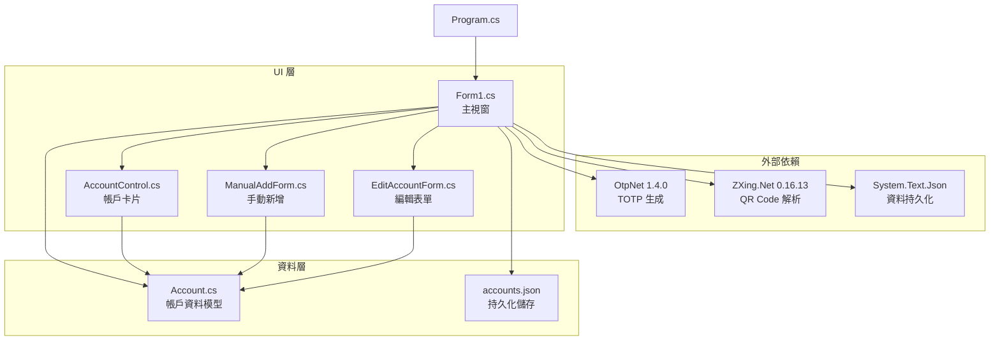
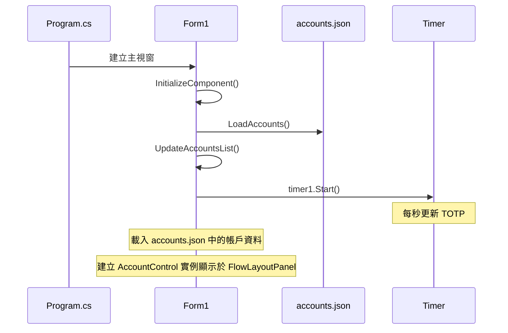
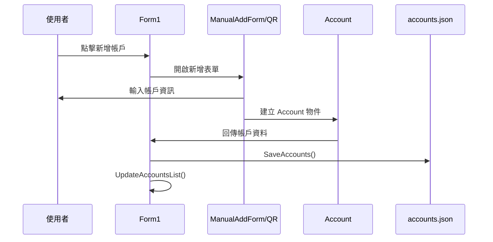
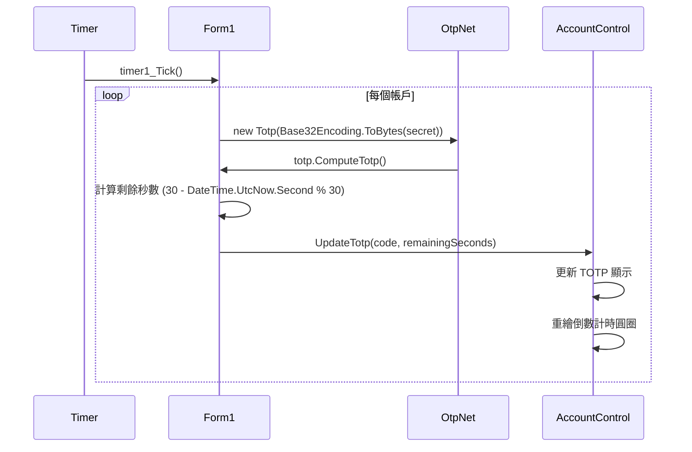

# TOTPAuthenticator

TOTPAuthenticator 是一個基於 Windows Forms 的桌面應用程式，用於生成和管理基於時間的一次性密碼 (TOTP)。它提供了一個現代化的使用者介面，支援手動新增帳戶、從 QR Code 檔案匯入，並允許使用者自訂和編輯每個驗證碼的額外資訊。

## 主要功能

*   **TOTP 生成**：根據帳戶密鑰生成標準的 TOTP 驗證碼。
*   **帳戶管理**：
    *   **手動新增**：允許使用者手動輸入帳戶名稱、密鑰、發行者和自訂字串。
    *   **QR Code 匯入**：支援從 QR Code 圖片檔案中讀取帳戶資訊（名稱、密鑰、發行者）。
    *   **編輯帳戶資訊**：為每個帳戶提供編輯名稱、發行者和自訂字串的功能。
    *   **刪除帳戶**：從列表中移除不再需要的帳戶。
*   **使用者介面**：
    *   **現代化設計**：採用深色主題和卡片式佈局，提供清晰直觀的視覺體驗。
    *   **即時倒數**：每個驗證碼卡片上顯示一個圓形倒數計時器，指示當前 TOTP 的剩餘有效時間。
    *   **搜尋功能**：快速篩選和查找特定帳戶。
    *   **一鍵複製**：點擊 TOTP 驗證碼或自訂字串即可複製到剪貼簿。
    *   **開啟設定檔資料夾**：直接開啟 `accounts.json` 所在的資料夾。
*   **資料持久化**：帳戶資料會自動保存到使用者應用程式的 Roaming 資料夾 (`%APPDATA%\TOTPAuthenticator\accounts.json`) 中，確保應用程式重啟後資料不會丟失。

## 專案結構

```
TOTPAuthenticator/
├───.gitattributes
├───.gitignore
├───accounts.json             # 帳戶資料儲存檔案 (位於 %APPDATA%\TOTPAuthenticator)
├───Form1.cs                  # 主視窗的程式碼
├───Form1.Designer.cs         # 主視窗的 UI 設計器程式碼
├───Form1.resx                # 主視窗的資源檔
├───ManualAddForm.cs          # 手動新增帳戶視窗的程式碼
├───ManualAddForm.Designer.cs # 手動新增帳戶視窗的 UI 設計器程式碼
├───ManualAddForm.resx        # 手動新增帳戶視窗的資源檔
├───EditAccountForm.cs        # 編輯帳戶視窗的程式碼
├───EditAccountForm.Designer.cs # 編輯帳戶視窗的 UI 設計器程式碼
├───EditAccountForm.resx      # 編輯帳戶視窗的資源檔
├───Account.cs                # 帳戶資料模型定義
├───AccountControl.cs         # 自訂帳戶卡片使用者控制項的程式碼
├───AccountControl.Designer.cs# 自訂帳戶卡片使用者控制項的 UI 設計器程式碼
├───AccountControl.resx       # 自訂帳戶卡片使用者控制項的資源檔
├───Program.cs                # 應用程式的進入點
├───README.md                 # 專案說明文件
├───TOTPAuthenticator.csproj  # C# 專案檔
├───TOTPAuthenticator.sln     # Visual Studio 解決方案檔
├───bin/                      # 編譯後的執行檔
└───obj/                      # 編譯中間檔案
```

## 架構分析

### 模組依賴圖



### 核心流程

#### 1. 應用程式啟動流程


#### 2. 新增帳戶流程


#### 3. TOTP 更新流程


### 關鍵設計模式

1. **MVC 模式**：
   - Model：`Account.cs` 資料模型
   - View：各種 Form 和 UserControl
   - Controller：`Form1.cs` 協調邏輯

2. **事件驅動**：
   - Timer 事件驅動 TOTP 更新
   - UI 事件處理使用者操作
   - 點擊事件處理複製功能

3. **組合模式**：
   - `AccountControl` 作為可重用的 UI 組件
   - 在 `Form1` 中動態生成和管理

### 技術細節

#### TOTP 實作
- 使用 `OtpNet` 套件生成 30 秒有效期的 TOTP 驗證碼
- Base32 編碼解析密鑰
- 自動計算剩餘時間：`30 - (DateTime.UtcNow.Second % 30)`

#### UI 功能
- **搜尋篩選**：支援帳戶名稱和發行者篩選
- **一鍵複製**：點擊 TOTP 或自訂字串自動複製至剪貼簿
- **視覺回饋**：複製成功後顯示「已複製!」1 秒鐘
- **倒數計時**：圓形進度條顯示 TOTP 剩餘時間，低於 5 秒變紅色

#### 資料持久化
- JSON 格式儲存至 `%APPDATA%\TOTPAuthenticator\accounts.json`
- 自動備份：每次更改帳戶即時儲存
- 支援特殊字元和 Unicode

#### QR Code 支援
- 使用 ZXing.NET 套件讀取 QR Code 圖片
- 支援格式：BMP, JPG, GIF, PNG
- 自動解析 `otpauth://totp/` URI 格式

## 如何建置與執行

### 前置需求
- **.NET 9.0 SDK** 或更高版本
- **Windows** 作業系統（Windows Forms 應用程式）
- **Visual Studio 2022** 或 **Visual Studio Code**（可選）

### 建置步驟

1.  **安裝 .NET SDK**：確保您的系統已安裝 .NET 9.0 SDK 或更高版本。您可以從 [Microsoft 官方網站](https://dotnet.microsoft.com/download) 下載。

2.  **複製專案**：
    ```bash
    git clone https://github.com/your-repo/TOTPAuthenticator.git
    cd TOTPAuthenticator
    ```

3.  **建置專案**：
    ```bash
    dotnet build
    ```

4.  **執行應用程式**：
    ```bash
    dotnet run
    ```
    或者，您也可以在 Visual Studio 中開啟 `TOTPAuthenticator.sln` 解決方案並執行。

### 發布單一檔案

為 Windows x64 建置獨立可執行檔：
```bash
dotnet publish -c Release -r win-x64 --self-contained -p:PublishSingleFile=true
```

編譯後的檔案在 `bin\Release\net9.0-windows\win-x64\publish\` 目錄中。
