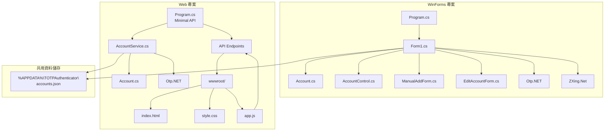
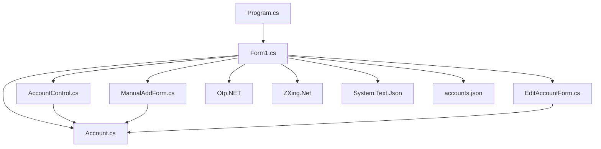
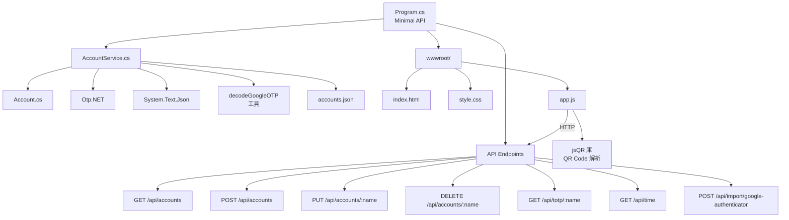
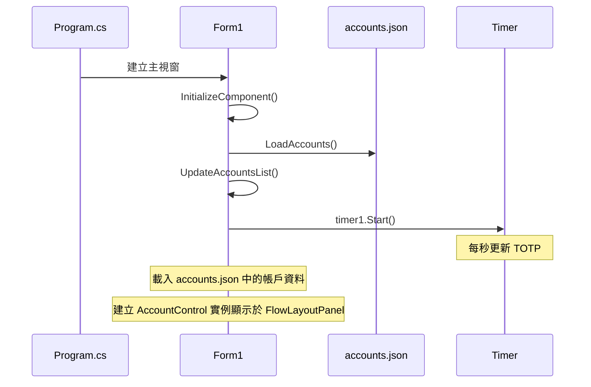
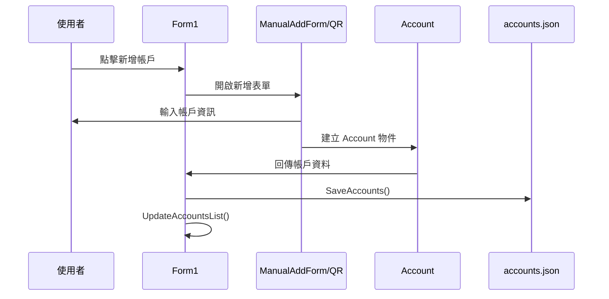
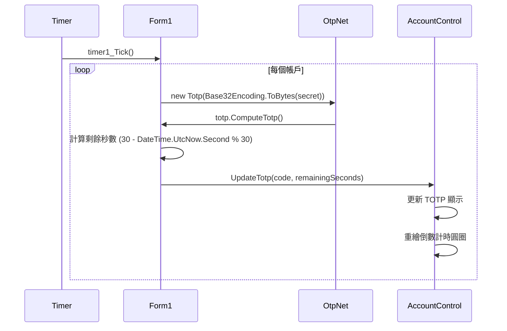

# TOTPAuthenticator

TOTPAuthenticator 是一個 .NET 9.0 專案，提供兩種版本的 TOTP (Time-based One-Time Password) 驗證器：

1. **Windows Forms 桌面應用程式** - 傳統桌面應用，適合 Windows 使用者
2. **ASP.NET Core Web 應用程式** - 現代化 Web 版本，可在任何裝置的瀏覽器中使用

兩個版本共用相同的資料儲存位置，可以互通使用。

## 主要功能

### 核心功能（兩個版本完全對等）

*   **TOTP 生成**：根據帳戶密鑰生成標準的 30 秒週期 TOTP 驗證碼
*   **帳戶管理**：
    *   **手動新增**：手動輸入帳戶名稱、密鑰、發行者和自訂字串
    *   **QR Code 匯入**：從單張 QR Code 圖片檔案讀取帳戶資訊
    *   **Google 驗證器匯入**：從 Google 驗證器的匯出圖片批次匯入多個帳戶
    *   **編輯帳戶**：更新帳戶的名稱、發行者和自訂字串
    *   **刪除帳戶**：移除不再需要的帳戶
*   **使用者介面**：
    *   **現代化設計**：深色主題和卡片式佈局
    *   **即時倒數**：圓形倒數計時器顯示 TOTP 剩餘有效時間
    *   **搜尋功能**：快速篩選和查找特定帳戶
    *   **一鍵複製**：點擊 TOTP 驗證碼或自訂字串即可複製到剪貼簿
*   **資料持久化**：帳戶資料自動保存到 `%APPDATA%\TOTPAuthenticator\accounts.json`

### WinForms 版本特色

*   **原生 Windows 體驗**：完整的系統整合
*   **QR Code 技術**：使用 ZXing.Net 庫進行解析
*   **單一執行檔**：可打包成獨立的 .exe 檔案
*   **離線運作**：不需要網路連線

### Web 版本特色

*   **跨平台存取**：可在任何裝置的瀏覽器中使用（Windows、macOS、Linux、行動裝置）
*   **RESTful API**：提供完整的 API 端點供其他應用程式整合
*   **響應式設計**：自動適應各種螢幕尺寸
*   **即時更新**：TOTP 碼每秒自動更新，無需手動刷新
*   **QR Code 技術**：使用 jsQR 庫在瀏覽器中直接解析
*   **純前端 QR Code**：QR Code 解析完全在瀏覽器中進行，無需上傳到伺服器

## 專案結構

```
TOTPAuthenticator/
├── TOTPAuthenticator.sln     # Visual Studio 解決方案檔 (包含兩個專案)
├── CLAUDE.md                 # Claude Code 專案說明
├── README.md                 # 專案說明文件
├── winforms/                 # WinForms 桌面應用程式專案
│   ├── Account.cs            # 帳戶資料模型
│   ├── AccountControl.cs     # 自訂帳戶卡片使用者控制項
│   ├── Form1.cs              # 主視窗
│   ├── ManualAddForm.cs      # 手動新增帳戶視窗
│   ├── EditAccountForm.cs    # 編輯帳戶視窗
│   ├── Program.cs            # 應用程式進入點
│   ├── TOTPAuthenticator.csproj
│   ├── Properties/
│   ├── Resources/
│   ├── bin/
│   └── obj/
└── webapp/                   # Web 應用程式專案
    ├── Account.cs            # 帳戶資料模型 (與 WinForms 共用結構)
    ├── AccountService.cs     # 帳戶管理服務 (含 Google 驗證器匯入邏輯)
    ├── Program.cs            # Web API 進入點和路由定義
    ├── EmbeddedStaticFilesMiddleware.cs  # 嵌入式靜態檔案中間件
    ├── TOTPAuthenticatorWeb.csproj       # 專案檔 (配置嵌入式資源)
    ├── wwwroot/              # 前端靜態檔案 (發布時嵌入到 exe)
    │   ├── index.html        # 主頁面 (引入 jsQR 庫)
    │   ├── style.css         # 樣式表
    │   └── app.js            # 前端邏輯 (含 QR Code 解析)
    ├── Resources/            # 資源檔案
    │   └── decodeGoogleOTP-windows-amd64.exe  # Google 驗證器解碼工具
    ├── Properties/
    ├── bin/
    └── obj/
```

**共用資料儲存位置**：
- `%APPDATA%\TOTPAuthenticator\accounts.json` (兩個專案都使用此檔案)

## 快速開始

### 執行 WinForms 版本

```bash
# 從根目錄執行
dotnet run --project winforms

# 或從 winforms 目錄執行
cd winforms
dotnet run
```

### 執行 Web 版本

```bash
# 從根目錄執行
dotnet run --project webapp

# 或從 webapp 目錄執行
cd webapp
dotnet run
```

Web 版本預設會在 http://localhost:5044 啟動，用瀏覽器開啟即可使用。

### 發佈應用程式

**WinForms 版本 (單一執行檔)**
```bash
cd winforms
dotnet publish -c Release -r win-x64 --self-contained -p:PublishSingleFile=true
```
執行檔位於 `winforms/bin/Release/net9.0-windows/win-x64/publish/`

**Web 版本 (單一執行檔，包含嵌入式靜態檔案)**
```bash
# Self-contained 發布，wwwroot 內容已嵌入到 exe 中
cd webapp
dotnet publish -c Release -r win-x64 --self-contained -p:PublishSingleFile=true
```
執行檔位於 `webapp/bin/Release/net9.0/win-x64/publish/`

**特色**：
- wwwroot 資料夾內容（HTML、CSS、JS）已嵌入到 exe 中
- 發布後無需單獨的 wwwroot 資料夾
- 只需要 `TOTPAuthenticatorWeb.exe` 和 `Resources/` 資料夾（用於 Google 驗證器匯入）
- 開發模式自動使用檔案系統，發布模式自動使用嵌入式資源

## 架構分析

### 整體架構圖



### WinForms 專案架構

詳細的 WinForms 專案模組依賴關係：



### Web 專案架構



### 核心流程

#### 1. 應用程式啟動流程


#### 2. 新增帳戶流程


#### 3. TOTP 更新流程


### 關鍵設計模式

1. **MVC 模式**：
   - Model：`Account.cs` 資料模型
   - View：各種 Form 和 UserControl
   - Controller：`Form1.cs` 協調邏輯

2. **事件驅動**：
   - Timer 事件驅動 TOTP 更新
   - UI 事件處理使用者操作
   - 點擊事件處理複製功能

3. **組合模式**：
   - `AccountControl` 作為可重用的 UI 組件
   - 在 `Form1` 中動態生成和管理

### 技術細節

#### TOTP 實作
- 使用 `OtpNet` 套件生成 30 秒有效期的 TOTP 驗證碼
- Base32 編碼解析密鑰
- 自動計算剩餘時間：`30 - (DateTime.UtcNow.Second % 30)`

#### UI 功能
- **搜尋篩選**：支援帳戶名稱和發行者篩選
- **一鍵複製**：點擊 TOTP 或自訂字串自動複製至剪貼簿
- **視覺回饋**：複製成功後顯示「已複製!」1 秒鐘
- **倒數計時**：圓形進度條顯示 TOTP 剩餘時間，低於 5 秒變紅色

#### 資料持久化
- JSON 格式儲存至 `%APPDATA%\TOTPAuthenticator\accounts.json`
- 自動備份：每次更改帳戶即時儲存
- 支援特殊字元和 Unicode

#### QR Code 匯入

**WinForms 版本**
- 使用 ZXing.NET 套件讀取 QR Code 圖片
- 支援格式：BMP, JPG, GIF, PNG
- 自動解析 `otpauth://totp/` URI 格式
- 後端處理，需要選擇本地圖片檔案

**Web 版本**
- 使用 jsQR 庫（純前端 JavaScript）
- 支援所有瀏覽器支援的圖片格式
- 使用 Canvas API 將圖片轉換為 ImageData
- 完全在瀏覽器中處理，無需上傳至伺服器
- 自動解析 `otpauth://totp/` URI 格式

#### Google 驗證器批次匯入

**WinForms 版本**
- 使用內嵌的 decodeGoogleOTP-windows-amd64.exe 工具
- 解析 Google 驗證器匯出的 QR Code 圖片
- 自動從暫存目錄提取解碼工具
- 支援批次匯入多個帳戶

**Web 版本**
- 檔案上傳至伺服器處理
- 使用 decodeGoogleOTP-windows-amd64.exe 工具解析
- API 端點：`POST /api/import/google-authenticator`
- 支援批次匯入多個帳戶
- 自動清理暫存檔案

## 如何建置與執行

### 前置需求
- **.NET 9.0 SDK** 或更高版本
- **Windows** 作業系統（WinForms 應用程式需要）
- **Visual Studio 2022** 或 **Visual Studio Code**（可選）
- **現代瀏覽器**（Web 版本需要，建議 Chrome、Edge、Firefox）

### 建置步驟

1.  **安裝 .NET SDK**：確保您的系統已安裝 .NET 9.0 SDK 或更高版本。您可以從 [Microsoft 官方網站](https://dotnet.microsoft.com/download) 下載。

2.  **複製專案**：
    ```bash
    git clone https://github.com/your-repo/TOTPAuthenticator.git
    cd TOTPAuthenticator
    ```

3.  **建置專案**：

    建置整個 solution（包含兩個專案）：
    ```bash
    dotnet build
    ```

    或分別建置：
    ```bash
    dotnet build winforms  # 只建置 WinForms 專案
    dotnet build webapp    # 只建置 Web 專案
    ```

4.  **執行應用程式**：

    **WinForms 版本**：
    ```bash
    dotnet run --project winforms
    ```

    **Web 版本**：
    ```bash
    dotnet run --project webapp
    ```
    然後在瀏覽器中開啟 http://localhost:5044

    或者，您也可以在 Visual Studio 中開啟 `TOTPAuthenticator.sln` 解決方案，選擇要執行的專案。

### 發佈應用程式

**WinForms 版本（單一執行檔）**

為 Windows x64 建置獨立可執行檔：
```bash
cd winforms
dotnet publish -c Release -r win-x64 --self-contained -p:PublishSingleFile=true
```

編譯後的檔案在 `winforms\bin\Release\net9.0-windows\win-x64\publish\` 目錄中。

**Web 版本（單一執行檔，包含嵌入式靜態檔案）**

發佈 Web 應用程式：
```bash
cd webapp
dotnet publish -c Release -r win-x64 --self-contained -p:PublishSingleFile=true
```

編譯後的檔案在 `webapp\bin\Release\net9.0\win-x64\publish` 目錄中：
- `TOTPAuthenticatorWeb.exe` - 主程式（已包含所有 wwwroot 靜態檔案）

**特點**：
- wwwroot 資料夾內容已嵌入到 exe 中，無需單獨部署
- 可直接執行，預設在 http://localhost:5044 和 http://0.0.0.0:5044 啟動
- 可部署到任何 Windows 伺服器
- 支援本地和網路訪問（0.0.0.0 允許局域網內其他設備訪問）

## 功能對比表

| 功能 | WinForms 版本 | Web 版本 |
|------|--------------|----------|
| **TOTP 生成** | ✅ | ✅ |
| **手動新增帳戶** | ✅ | ✅ |
| **QR Code 圖片匯入** | ✅ (ZXing.Net) | ✅ (jsQR 前端) |
| **Google 驗證器批次匯入** | ✅ (內嵌工具) | ✅ (API 上傳) |
| **編輯帳戶** | ✅ | ✅ |
| **刪除帳戶** | ✅ | ✅ |
| **搜尋功能** | ✅ | ✅ |
| **圓形倒數計時器** | ✅ | ✅ |
| **點擊複製** | ✅ | ✅ |
| **深色主題** | ✅ | ✅ |
| **資料共用** | ✅ (accounts.json) | ✅ (accounts.json) |
| **跨平台** | ❌ (僅 Windows) | ✅ (所有平台) |
| **RESTful API** | ❌ | ✅ |
| **響應式設計** | ❌ | ✅ |
| **離線運作** | ✅ | ⚠️ (需伺服器) |
| **單一執行檔** | ✅ | ❌ |

## 技術棧

### WinForms 版本
- **.NET 9.0** - Windows Forms
- **Otp.NET** - TOTP 生成
- **ZXing.Net** - QR Code 解析
- **System.Text.Json** - 資料序列化
- **decodeGoogleOTP** - Google 驗證器解碼

### Web 版本
- **ASP.NET Core 9.0** - Minimal API
- **Otp.NET** - TOTP 生成
- **jsQR** - 前端 QR Code 解析
- **System.Text.Json** - 資料序列化
- **decodeGoogleOTP** - Google 驗證器解碼
- **Vanilla JavaScript** - 前端邏輯
- **Canvas API** - 圖片處理

## 貢獻

歡迎提交 Issue 和 Pull Request！

## 授權

本專案採用 MIT 授權條款。
